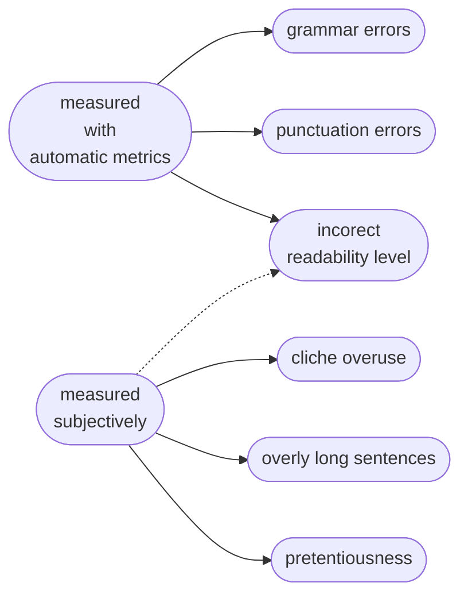

<blockquote>
<ul>
    <li>Is there a qualitative difference in the errors made by humans and machines when generating the text?</li>
    <li>Is it possible to distinguish between human-generated and machine-generated text, when the text written by humans contains many errors and is of poor quality?</li>
</ul>
</blockquote>


This project was created in 2019, with the idea of having a glance at the possible text generation error categorization for Even with technology from several years ago, it was not difficult to make people believe a text was written by a human, using simple, easy-to-use online tools. Now, the when the text generation nears perfection we can ask this question again - is there anything that will help us distinguish between the two? Could it be that the imperfections are what makes us human, and, ultimately, not machines? Since the project was completed and closed several years back, it covers state-of-art models of that time, such as BERT or XLNet. It would be great to repeat it with the newest generative AI models, to see if there is any legacy from older transformers and whether the NLG errors are as distinctive as they used to be. 


## What is this project about?<a name="introduction"></a>


Text generation is one of the most basic functions we associate with language models. Understanding commands is one thing, but the beauty of having a atrificial intelligence answer you in a human-like manner is quite another. One of the first defined challenges in the rise of the era of artificial intelligence was creating a machine or program which will make you believe it is human, aptly measured by what we call the Turing Test[^3]. While it might seem to us that the first models would have been easy to recognize as fake humans, it seems they were actually quite good at playing pretend [^4]. Probably because the humans confronting them did not really know what to look for and what abilities to expect from them - they were taken by suprise, unprepared for the amazing progress AI made. And the same can be said today, with the newest generative models we can all access at the tip of our fingers.


This project was first created in 2019, using the contemporary generative models to explore the errors we all make when creating new text. We - the humans and the machines. The question I wanted to answer at this time was whether there is some qualitative difference between the human and AI errors and whether we might be able to recognize the authorship of the text by the errors made. Even with technology from several years ago, it was not difficult to make people believe a text was written by a human, using simple, easy-to-use online tools. Now, the when the text generation nears perfection we can ask this question again - is there anything that will help us distinguish between the two? Could it be that the imperfections are what makes us human, and, ultimately, not machines?


If that topic caught your attention, you can read on to see how the project went and what I have learned from it. If you'd rather skip ahead and just look at the results - you can use the list on the left to scan through the content quickly. If you'd prefer are more formal, techinical report, you can download it here: [link to google drive]. And finally, if you have any comments or ideas, feel free to reach out to me: []. If you use this work, please don't forget to cite it as: [].


## Who even cares about the actual authorship?


Creating and using NLG (Natural Language Generation) models might pose many moral and ethical issues. Many of those issues are common with the issues raised regarding the development of artificial intelligence in general, including the presence of biases, the possible manipulation of human behaviour or the impact on the work market [^5](cf. Müller 2020). Some of the issues are more prevalent than others and are already being discussed outside of a clearly hypothetical terms within the research community. Previously the most widely discussed problem was the model bias. In language models such bias could be characterized as a tendency to assign certain qualities in produced text to certain groups of people – for example certain races or women (cf. e.g. He et al., 2019)[^6]. The source of the bias is the data that is used for training the models – the “opinions” in a language model will reflect the most prevalent opinions present in the textual data that was used for the training. With the numerous AI revelations of the year 2023, another issue took the spotlight - the question of copywright, content ownership and the ethics of different types of deep fakes. Still, even before the recent explosion of AI awarness, such issues were often mentioned as potential risks [^7][^8](Leidner and Plachouras, 2017; Williams 2018).


<blockquote>
Deeper understanding of the unique characteristics of AI-generated text is extremly important given the big role NLG strats to play in our everyday lives. If we understand better how the text produced by AI measures up to the text produced by humans, we can both work for improving the quality of human-computer interaction, but also aim to prevent any unethical applications. One of the methods of studying those differences is the analysis of various text generation errors such as in this project.
</blockquote>


## Your text is better because… it sounds better? How can we measure written language quality.
For the purpose of this study, we started with splitting writting errors into two major categories - errors in form and errors in style. You can see how we categorize them in the figure below this paragraph. The first type, the form errors, consists of errors such as typos, grammar errors or incorrect punctuation usage. The second type includes more sucjective writing mishaps - here we select to concentrate on problems such as presence of clichés, pretentious style and using particularly long sentences, all quite easy to recognize in short text that we use as our data. To make differentiating between those error types easier, the table below shows a simple example for each of the categories. There is also one large group of errors - the errors in logic, which we omit here, mostly because they are difficult to study in very short text fragments. To read more different language errors and their definitions, you can check out the following sites: [].





Below there are some of the more interesting stylistic errors we measure, inlcuding text with sentences that are too long to be comprehended easily, texts containing pretentious writing as well as a short text using too many cliches. As you can see, some of those might be defecult even for humans to detect. But, the interesting question is - can AI make such errors, or is it largely a human trait?
> ##### VERY LONG SENTENCES
> If we contrast the  past situation where  although a doctor  may not have been  able to cure a  patient, he would  have visited the  patient regularly  giving emotional  support; with a  situation that might  occur today, such as  the impersonal  treatment of a  patient using highly  sophisticated  technology, it could  be argued that this  transition has  produced a less  humane or  compassionate system
><i>(https://studylib.net/doc/7492407/samples-of-bad-writing)</i>
{: .block-danger }


> ##### PRETENTIOUS WRITING
> As I commence my  journey to ascertain  knowledge to  optimally communicate my  story with the  citizens of  tomorrow, I aim to  transcend the lives  of those I have yet to  meet as the literary  legends I applauded  had accomplished  for me.
><i>(https://elliotchan.com/2020/03/29/what is-pretentious-writing/)</i>
{: .block-danger }


> ##### USING CLICHES
> By their very nature  cabarets tend to be a  bit of a hit and miss  affair. Some nights  they are life affirming and others  resemble a weekly  revival of last weekend's Comic  Relief. A cabaret  night in an ordinary  pub is probably a  safe bet though, as  long as you can  handle a few kitsch  pieces of fish for  comedy value. The  aim is to bring a bit  of light relief to dark  lives. Your best bet  though is to try out  the events in  Hastings on  Wednesday  evenings. From  5.30pm-6pm, Leopold's Jazz Club  presents another of  its weekly night  dedicated to cabaret  and jazz.
><i>(https://mantex.co.uk/improve-your writing-skills/bad-writing/)</i>
{: .block-danger }


## Our data


Our human-generated dataset consists of short texts collected on the internet blogs and forums. The main criterion was the quality of the writing - we selected texts that are badly written. Who got to decide what was a badly written text? We started the search with some list of error examples compiled onlie [ref] and then selected text that contained different types of writing style errors in particular (in
comparison to formal errors such as grammatical or punctuation errors). The texts range from 100 to 1000 characters (if a text was longer,  an excerpt is taken). There was a total of 13 texts collected, most in a general domain  (i.e. avoiding texts containing domain-specific vocabulary).


Taking the first sentences of all the text as a prompt and asking the model to continue the story, we collected the AI-generated datasets with several demo models [website ref]. For the models, we used three SOTA models avaiable at the time of the study - GPT-2 (Radford  et al., 2019), XLNet (Yang et al., 2019) and Megatron-11b (Shoeybi et al., 2019). Each model generated one text for each sample in the human-generated dataset, giving us 39 AI-generated text fragments.


[link text fragments (at the bottom of the whole project)]
## Through error comparison to authorship detection. Our experiments.


Our main goal is to learn whether we can recognize if the author of the text is human or not - all by looking only at the errors in the generated text. We use two types of evaluation - automatic (based on linguistic metrics) and manual (based on human evaluation).


> <font size="5">LINGUISTIC METRICS</font>
>
>- Flesch Reading Ease and Flesh-Kincaid Grade (Flesch, 1946)
>- Gunning Fog Score (Gunning, 1952)
>- Coleman Liau Index (Coleman and Liau, 1975)
>- Automated Readability Index (ARI) (Senter and Smith, 1967)
>- SMOG Index (McLaughlin, 1969)
>- Percentage of complex words
>- Avarage word/sentence length


> <font size="5">HUMAN EVALUATION</font>
>
>- L1 and L2 speakers
>- 13 sets, each set with 4 versions of the same text
>- 3 participants in the initial study
>- asked to determine which of four texts in each set was written by a human and provide reasoning


Each evaluation serves to approach the question of text authorship assignment from a slightly different angle. If we look at the automatic metrics, we can of course try to find out if there is an easy automated method to figure our which text is AI-generated, for example for the sake of preliminary filtering of fake content. Another interesting question is, whether there are any common traits, such as overly complicated or overly simple text, when it comes to materials produced by the generative models. On the other hand, with human evaluation, we want to check if the models can actually "cheat" humans into believing they are actually reading a text written by a real person. If yes, what are the reasons which allowed our participans to make the distinction?


For the automatic metrics, we follow the related papers to directly calculate the score for each text, be it human- or computer-generated. For the human evaluation, we hand each of the evaluators following questionnaire and collect their answers.


## What did we learn


Starting with the most interesting question - did the models generate text that could me mistaken by human-written content, the answer is absolutely yes. The average accuracy of our participants guessing which text was human-generated was only 41%, with the lowest scoring pariticipant obtaining only 23% average for his guesses (which is below the random guess value). In particular, texts geenrated by Megatron (the biggest model we tested) were most often mistaken as geniune stories written by human authors. This makes a lot of sense, as NN models are data-greedy. Usually the bigger the LLM and the more data was used to train it, the better it will perform.


If we look at the figure below, showing what made our participants believe that the text was fake, most common reason provided was the text "making no sense." Other common reasons were unnecessary repetitions and grammar or punctuation errors. The repetition error is a common issue in Natural Language Generation in NN models with various architectures, not only transformer [], but also in LSTM [] or CNN [] networks. This error usually boils down to the fact that [].


```chartjs
{
  "type": "doughnut",
  "data": {
    "labels": [
      "makes no sense",
      "word and phrase repetition",
      "grammar or punctuation errors",
      "other"
    ],
    "datasets": [
      {
        "data": [
          33.3,
          26.7,
          20,
          20
        ],
        "backgroundColor": [
          "#9b59b6",
          "#3498db",
          "#f4d03f",
          "#48c9b0"
        ],
        "hoverBackgroundColor": [
          "#FF6384",
          "#36A2EB",
          "#FFCE56",
          "#FFCE56"
        ]
      }
    ]
  },
  "options": {
  }
}
```


Having a look at various automatic metrics describing different qualities of written text, one thing stands out. The original text written by a human author was most difficult to read based on all automatic readability metrics we tested. For Flesch-Kinkaid Readability Ease score, the higher the result, the easier the text should be to read. Here []


```chartjs
{
  "type": "bar",
  "data": {
    "labels": [
      "human",
      "gpt",
      "xlnet",
      "infer"
    ],
    "datasets": [
      {
        "label": "FRE",
        "data": [
          52,
          70,
          80,
          71
        ]
      },
      {
        "label": "FRGL",
        "data": [
          12,
          10,
          9,
          8
        ]
      },
      {
        "label": "GFS",
        "data": [
          18,
          14,
          12,
          11
        ]
      },
      {
        "label": "GFS",
        "data": [
          18,
          14,
          12,
          11
        ]
      }
    ]
  },
  "options": {
  }
}
```


This result also nicely corelates with the writing errors we discussed earlier - for now seemingly mostly limited to human authors, such as pretentiousness, using cliches or, indeed, using very long sentences.


```chartjs
{
  "type": "bar",
  "data": {
    "labels": [
      "human",
      "gpt",
      "xlnet",
      "infer"
    ],
    "datasets": [
      {
        "label": "# words per sentence",
        "data": [
          59,
          29,
          36,
          18
        ]
      }
    ]
  },
  "options": {
  }
}
```


It was also interesting to find, that in cases where humans mistakingly thought that the text is fake (when it was actually writen by human), the text contained stylistic errors, especially sentences that were so long that it impacted their legilbility. When we look at the average lenght of sentences marked with such error in the table below, we can see that the human-generated sentences were far longer (averaging at 60 words per sentence) than the AI content.


>That means that if we want to know the author by the errors they make - very long and hard to follow sentences almost certainly indicate human authorship. 

